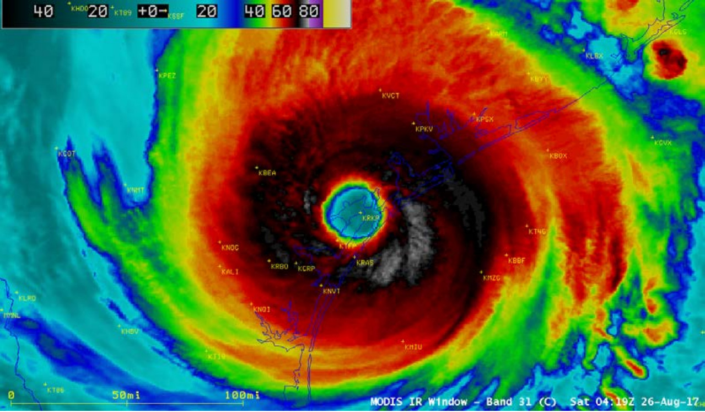

# Houston Emergency Coders

### Hypothesis

If we learn from our past with Harvey, then we will be able to significantly reduce future flood risk.

### Historical Background

The major water discharge of the Addicks and Barker Reservoirs occurred on 8-26-2017.

The first water gauge below the reservoir recorded a 22 foot rise in the Buffalo Bayou.

This was during just a 24 hour period which initiated the major flooding in West Houston.

In general, Buffalo Bayou started receeding around 9-10-2017 (16 days later).
